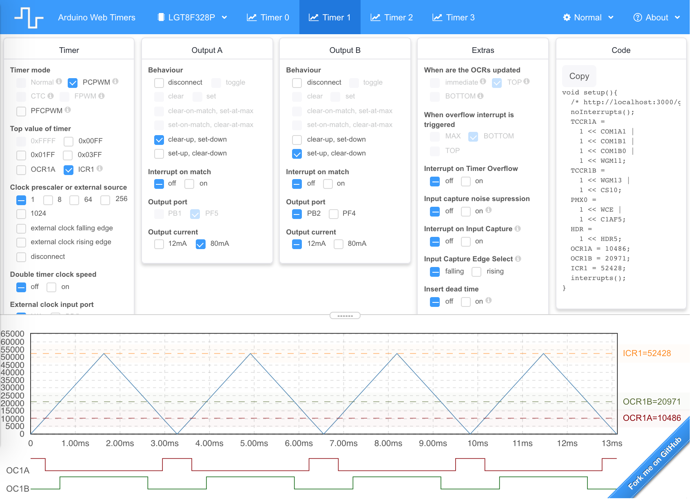

# Arduino Web Timers

## [Click here to open the Web App](https://dbuezas.github.io/arduino-web-timers/)

Application to configure and visualise timers. All your changes are stored in the url, bookmark and share configured timers!

## Supported microcontrollers:

- Atmel atmega328p (e.g Arduino Uno, Nano, Pro-mini)
- Logic Green lgt8f328p [checkout this core](https://github.com/dbuezas/lgt8fx)
- If people uses this, I can add more (e.g attiny)

## Supported timers (all!)

- Timer0
- Timer1
- Timer2
- Timer3

## Supported modes (all!)

- Normal
- Fast PWM
- CTC
- Phase Correct PWM
- Frequency Phase Correct PWM

## Supported features (all!)

- Code Generation
- Output Compare Match Interrupts
- Input Compare Interrupt
- All output generation modes
- Select output pins
- Clock prescalers
- External clock
- Dead Time
- Timer clock speed doubling
- High current output
- Port muxing
- ...

## How does this work?

- I manually extracted all relevant tables from the microcontrollers' datasheets and stored them as `tab separated value` (tsv) tables. [Here](https://github.com/dbuezas/arduino-web-timers/blob/master/src/data/atmega328p/timer0.tsv) is atmega328p timer0 for example.
- There you'll find 2 kinds of data:
  - Registers: One register per column, each cell is the name of a bit.
  - Constraints: Each column represents a variable (can be a bit of a register or some UI input or output). Each row is a possible valid combination of values assigned to variables.
- When the user selects any checkbox, the possible values of the variable it represents is reduced to only what's selected
- A custom constraint solver finds out what values are possible for each of the other variables and the rest is disabled in the UI (note that tables are interconnected when they share variables)
- Given the user selection, a suggestion for all other variables is created one by one by:
  - Computing the viable values of a variable
  - Picking the first viable value for that variable 
  - Repeating until all variables have only one viable value
- Finally the values of variables are used to run the simulation (plot) and write the code.
- The code output is generared by iterating over each regiser and picking the bits that are set to one.

A fun fact: I learned a lot about timers myself while creating this web app, but even more by playing with it!

--

# Development

`npm install`
`npm run start`

# Deployment

A Gihub action for deployment is automatically triggered on each commit to master.

It can also be done locally via: `npm run deploy`
